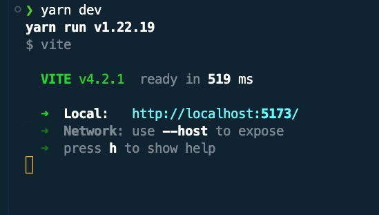

# OpenMarketHub Front End
Startup Company for open market hub for selling or buying products and  services 
- Front End Application


### Technology Stack for the front end
---

- [React](https://legacy.reactjs.org/)
- [Typescript](https://www.typescriptlang.org/)
- [Vite](https://vitejs.dev/)
- [Material UI](https://mui.com/)
- [GitHub Actions](https://github.com/features/actions)


### For running the project
---
```bash
git clone https://github.com/dhunganabibek/open-market-hub-frontend.git
cd openmarket-hub-front-end
yarn install 
yarn dev
```

### This will start the development server as:
---


### The deployment is automated with github actions on pull request to main branch
---
```yaml
name: OpenMarketHub frontend CI-CD

on:
  push:
    branches: ["main"]
  pull_request:
    branches: ["main"]

jobs:
  build:
    runs-on: self-hosted

    strategy:
      matrix:
        node-version: [16.x]
        source:
          [/actions-runner-openmarkethub/_work/open-market-hub-frontend/open-market-hub-frontend/dist/*]
        destination: [/var/www/openmarkethub.com/openmarkethub]

    steps:
      - uses: actions/checkout@v3
      - name: Use Node.js ${{ matrix.node-version }}
        uses: actions/setup-node@v3
        with:
          node-version: ${{ matrix.node-version }}
          cache: "npm"
      - run: sudo apt install -y nodejs
      - run: sudo apt install -y npm
      - run: sudo npm install -g yarn
      - run: yarn install
      - run: yarn run build
      - run: sudo cp -r ${{matrix.source}} ${{matrix.destination}}
```

