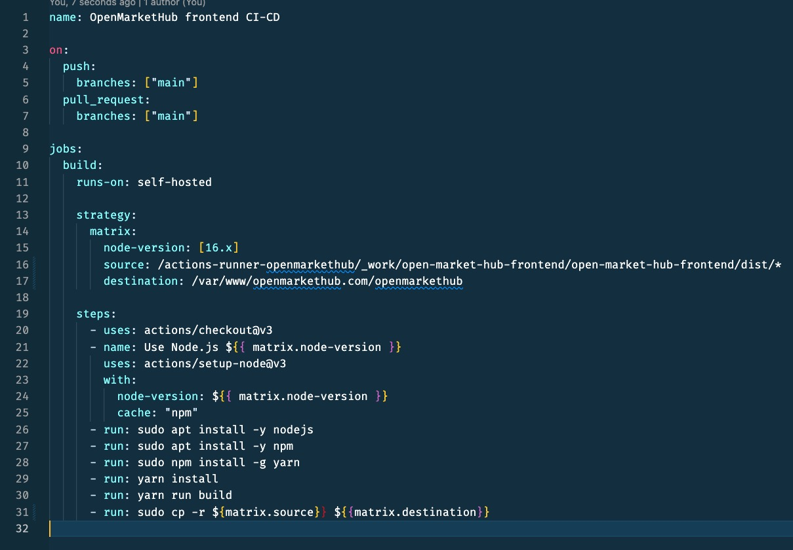

# OpenMarketHub FrontEnd
Startup Company for open market hub for selling or buying products and  services (Frontend)    


&nbsp;&nbsp; &nbsp;
## Technology Stack for the front end
---

1. React with TypeScript
2. Vite
3. Material UI
4. GitHub Actions for CI-CD

&nbsp;&nbsp; &nbsp;
## For running the project
---
```bash
git clone https://github.com/dhunganabibek/open-market-hub-frontend.git
cd openmarket-hub-front-end
yarn install 
yarn dev
```

## This will start the development server as:
---


## The deployment is automated with github actions on pull request to main branch
